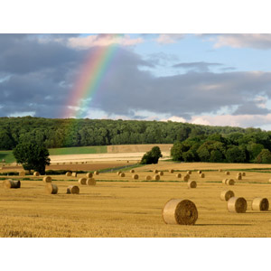

# PhotoLabelizer

画像ファイルの説明文を英語で生成し,そこからファイル名を自動で生成する.

現状, CLIベースのツールで,毎回確認コマンドを入力しながらの変換になる.

## 環境

| 対象   | バージョン    |
| :----- | :------------ |
| python | python 3.11.4 |
| pip    | pip 23.1.2    |

## 使用方法

### 1. 必要なライブラリのインストール

```powershell
pip install salesforce-lavis
pip install googletrans==3.1.0a0
```

### 2. ツールの実行

src/main.py を実行する.

引数には画像ファイルのパス,または画像ファイルが配置されているディレクトリのパスを入力する

途中で変更確認があるため, Y または N を入力する

例：

```powershell
python .\src\main.py {ファイルパスまたはディレクトリパス}
```

- :warning: ただし,正規表現は使用不可

### 使用例:

> _**海の隣の壁に座っている若い男.jpg**_


> _**干し草畑の上の空にかかる虹.jpg**_



> _**野原の植物に手を伸ばす手.jpg**_


