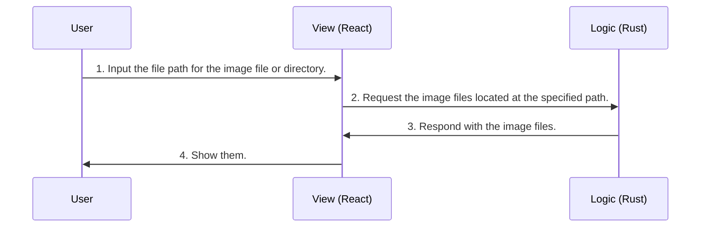
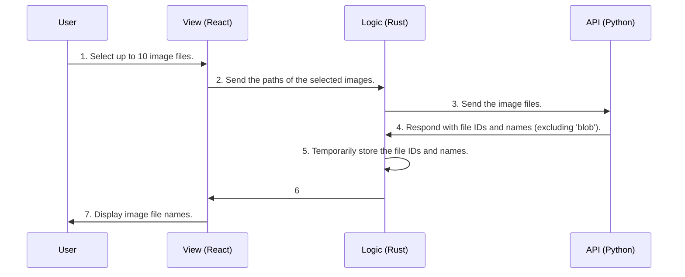
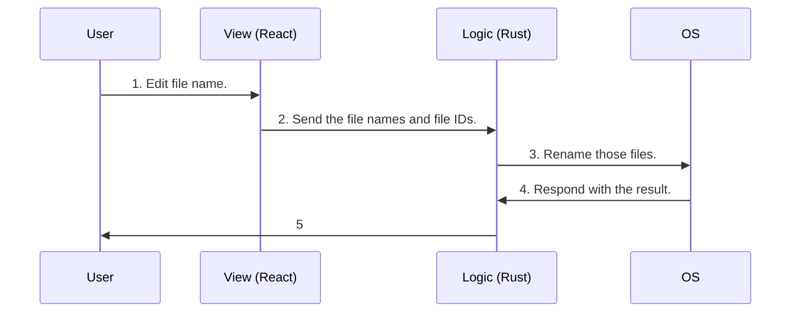

# Photo Labelizer Client

## How to Develop

### Technology

- [Tauri](https://marketplace.visualstudio.com/items?itemName=tauri-apps.tauri-vscode):
  Desktop application Framework by [Rust](https://doc.rust-lang.org/book/)
- [Vite](https://ja.vitejs.dev/)
  - [React](https://react.dev/)
    - [Material UI](https://mui.com/)
  - [Typescript](https://www.typescriptlang.org/)
- [Docker](https://www.docker.com/): Docker Scout secures the complete software
  supply chain by providing image analysis, real-time vulnerability
  identification, contextual remediation recommendations, and more. Now
  generally available. [VcXsrv](https://sourceforge.net/projects/vcxsrv/):
  Windows X-server based on the xorg git sources (like xming or cygwin's xwin),
  but compiled with Visual C++ 2012 Express Edition. Source code can also be
  compiled with VS2008, VS2008 Express Edition and VS2010 Express Edition,
  although current project and makefile are not fully compatible anymore.

#### Recommend

- [VS Code](https://code.visualstudio.com/)
- [rust-analyzer](https://marketplace.visualstudio.com/items?itemName=rust-lang.rust-analyzer)

### How to Build

```powershell
docker compose build
```

### How to Run

```powershell
docker compose up
```

## Design

### 1. Get image files



### 2. Suggest image file names



### 3. Rename files



## Referencies

- [【React / Next】ドラッグ&ドロップで画像を複数選択してDBにアップロードする](https://qiita.com/hyaguchi947d/items/77f41571126c8cb9d326)
